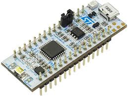

# stm32f303k8

Barebone Blink  
  
Blink = ST HAL  
Simple = ST HAL UART Serial Communication  
SPL = StdPeriphLib

Development IDE  
System Workbench for STM32  
http://openstm32.org/System%2BWorkbench%2Bfor%2BSTM32  

master branch is not updated regularly. Current working version is in develop-branch!
develop is protected and can only be merged with features.

See GIT-Flow:  
https://nvie.com/posts/a-successful-git-branching-model/  
https://danielkummer.github.io/git-flow-cheatsheet/
  

